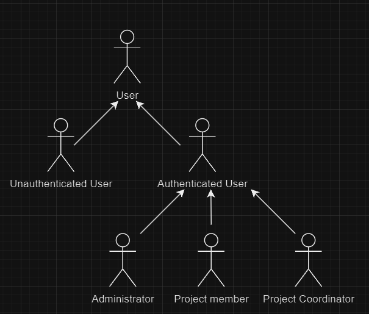
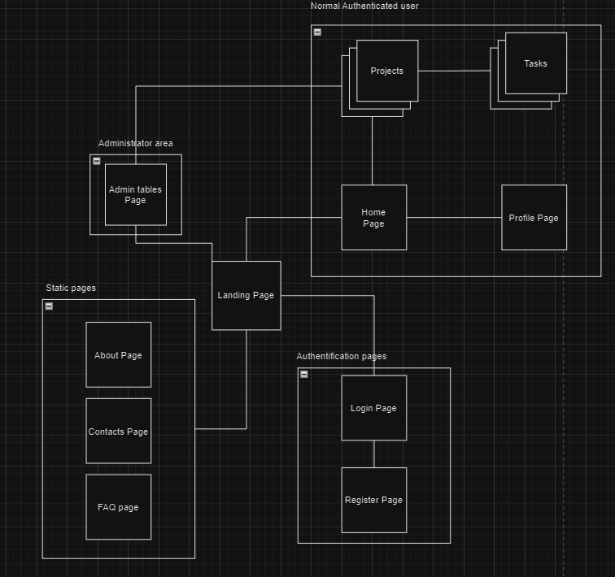
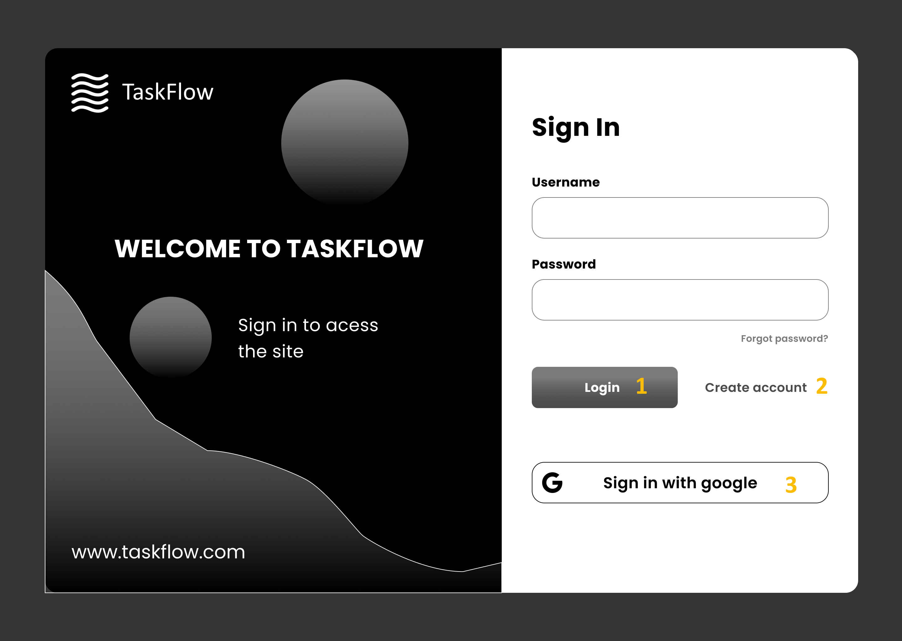
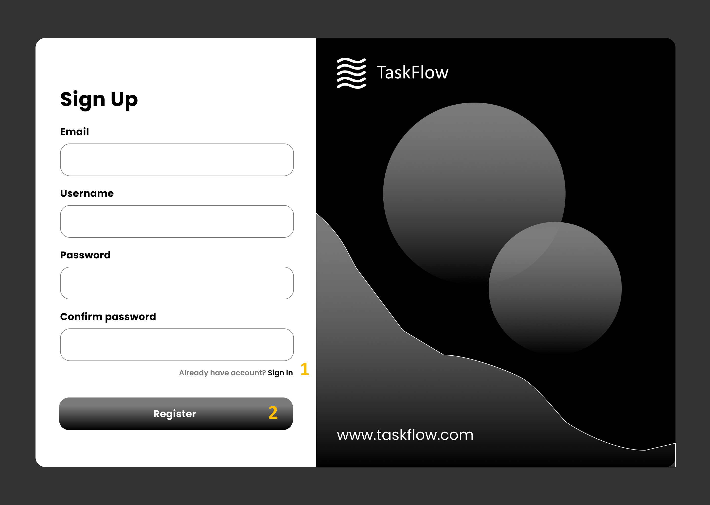
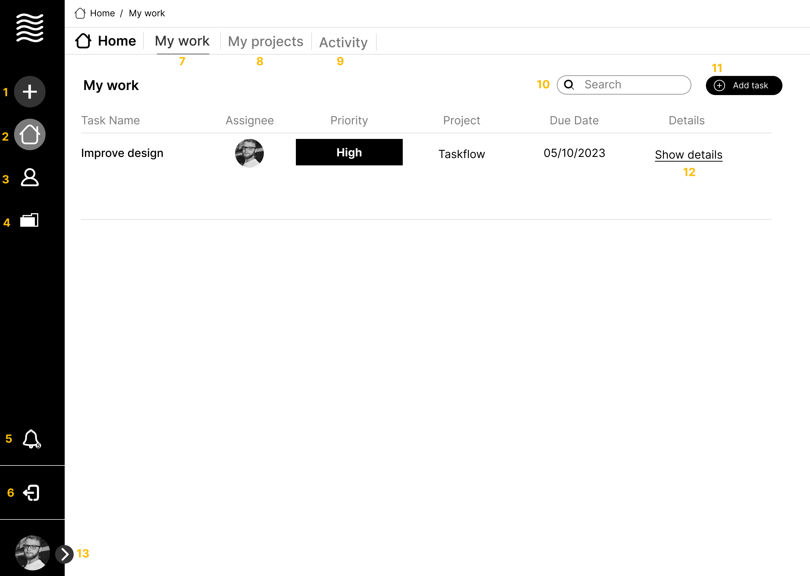

# ER: Requirements Specification Component

> Taskflow is the innovative online platform for task and project management, empowering users to efficiently lead their teams while gaining clear visibility into completed tasks and outstanding work.

## A1: Taskflow

Project management is a foundational pillar for modern organizations, Simplifying functions such as project planning, resource allocation, and collaborative Efforts. It Enables teams to define objectives, Assign responsibilities, and monitor progress, all while Promoting efficient communication and risk Relief. With this in mind, we Started working on the development of TaskFlow. So, what exactly is TaskFlow? TaskFlow embodies our vision to create a user-friendly website that simplifies project management, ensuring that every team can effortlessly stay on top of their tasks without workflow disruptions. Our goal is to Popularize project management, making it accessible to all. We aspire to eliminate the complexities that often Restrict teams productivity and success in the execution of the project. TaskFlow is not just a tool it's a Facilitator for organizations to excel in their work, enhance collaboration, and seamlessly maintain productivity. TaskFlow has 4 different types of users, with different permissions: unauthenticated users, collaborators, coordinators and administrators. The unauthenticated users can only access the landing page where they will be able to logIn or Register in our platform, the FAQ page, the contacts page, and the About page. When an unauthenticated user created an account he will then be a collaborator, with a profile page that can be edited by him or viewed by other collaborators. Once the user is a collaborator he can then be assigned to projects and therefore tasks. If the collaborator decides to create a project he will then becomes the coordinator of that project. He can then add collaborators to the team and assign them with tasks. He will also be able to edit and delete task created by others. All the team will be able to access the task list and discussion forum for that project, as well as comment on all the tasks. The users will be able to search for specific projects or tasks, and view all the projects they are a part of, and all the tasks assigned to them. Administrators will be allowed to change roles of users and manage all of the ongoing projects.

## A2: Actors and User stories

> The subsequent sections offer comprehensive information about our project, including Actors, User Stories, and Supplementary requirements.

### 1\. Actors

{width="512" height="436"}

_Figure 1._ Actors

| Identifier | Description |
|------------|-------------|
| User | A standard user with access to publicly available information and basic functionalities. |
| Unauthenticated User | A visitor who can explore the platform but needs to create an account or log in to access additional features. |
| Authenticated User | A registered user who can manage their personal information, accept team invitations, and access core platform features. |
| Project Member | An authenticated user who is part of one or more projects, enabling them to collaborate, track project progress, and update task statuses within those projects. |
| Project Coordinator | An authenticated user with additional responsibilities within a project, such as editing and deleting tasks assigned by other users, as well as managing collaborators and overseeing project progress. |
| Admin | An authenticated user with elevated privileges responsible for user management and certain moderation functions within the system. |

Table 1: Taskflow actors description

#### Unauthenticated user

| Identifier | Name | Priority | Description |
|------------|------|----------|-------------|
| FR.101 | Sign in | high | As an Unauthenticated User, I want to be able to sign in and create an account |
| FR.102 | Sign up | high | As an Unauthenticated User, I want to be able to sign up and log in to my account |
| FR.103 | Recover password | high | As an Unauthenticated User, I want to be able to recover my password in case I forget it |
| FR.104 | Sign In and Sign Up using external API | low | As an Unauthenticated User, I want to authenticate into the system using an external account |

Table 1: Unauthenticated user's user stories

#### Authenticated user

| Identifier | Name | Priority | Description |
|------------|------|----------|-------------|
| FR.201 | Create project | high | As a user I want to be able to create a new project so that i can start to manage a project |
| FR.202 | View my projects | high | As a registered user, I want to be able to view a list of all the projects I've created, so that I can easily access and manage them |
| FR.204 | Mark project as favorite | medium | As a registered user, I want to be able to mark a project as a favorite, so that I can easily access it from a dedicated list of favorite projects |
| FR.205 | Logout | high | As a registered user, I want to be able to logout of my account |
| FR.206 | Report Projects | medium | As a user, I want to be able to report projects that I think are harmful or dangerous for other users |

Table 2: Authenticated user's user stories

#### Project member

| Identifier | Name | Priority | Description |
|--|------|----------|-------------|
| FR.301 | Create task | high | As a project member, I want to be able to create a new task within a project, so that I can effectively organize and manage the project's workload |
| FR.302 | Manage tasks | high | As a project member, I want to be able to manage task details such as priority, labels, and due date, so that I can prioritize and categorize tasks effectively. |
| FR.303 | Assign users to task | high | As a project member, I want to be able to assign specific tasks to individual team members, so that responsibilities are clearly defined |
| FR.3404 | View task details | high | As a project member, I want to be able to view the details of a task, so that I can understand its requirements and status. |
| FR.305 | Comment on task | high | As a project member, I want to be able to leave comments on tasks, so that I can provide updates or ask questions related to the task. |
| FR.306 | Complete an assigned task | medium | As a project member, I want to be able to mark a task as complete, so that the team is aware of the progress. |
| FR.307 | Leave project | high | As a project member, I want to be able to leave a project, so that I no longer have access to its tasks and updates. |
| FR.308 | View project team | medium | As a project member I want to see who I am working on a project with |
| FR.309 | View team member's profiles | low | As a project member I want to see the profiles of the people I am working on a project with |
| FR.310 | Search tasks | medium | As a project member I want to be able to search for tasks assigned to my project |
| FR.311 | Assign myself to tasks | medium | As a project member I want to be able to assign myself to tasks so I can start immediately working on them |
| FR.312 | Receive notification | high | As a user, I want to receive notifications when a task I manage or participate in is marked as completed, ensuring that I am aware of the task's progress |
| FR.313 | Assigned to task | high | As a user, I want to be notified when I am assigned to a new task so that I can promptly begin working on it |
| FR.314 | Accepted invitation to Project | high | As a user, I want to receive a notification when I accept an invitation to join a project, allowing me to acknowledge my involvement |
| FR.315 | Change in Project Coordinator | medium | As a user, I want to be notified if there is a change in the project coordinator, ensuring that I am aware of the project's leadership structure |

Table 3: Project Member's user stories

#### Project Coordinator

| Identifier | Name | Priority | Description |
|------------|------|----------|-------------|
| FR.501 | Add user to project | high | As a Project Coordinator, I want to add a user to the project, enabling them to collaborate on project tasks and activities. |
| FR.502 | Assign new coordinator | medium | As a Project Coordinator, I want the ability to assign a new coordinator to the project in case of role changes or team restructuring. |
| FR.503 | Edit project details | high | As a Project Coordinator, I need to be able to edit project details such as its name, description, and other relevant information to keep it up-to-date. |
| FR.504 | Assign task to member | high | As a Project Coordinator, I want to assign tasks to project members so that work is efficiently distributed and tracked. |
| FR.505 | Remove project member | high | As a Project Coordinator, I want to be able to remove a project member if they are no longer involved or needed in the project. |
| FR.506 | Archive project | medium | As a Project Coordinator, I want the capability to archive a project once it is completed or no longer active, keeping the project history and data accessible but out of the active project list. |

Table 4: Project Coordinator's user stories

#### Administrator

| Identifier | Name | Priority | Description |
|------------|------|----------|-------------|
| FR.701 | Browse projects | high | As an administrator, I want to be able to browse through all the projects in the system |
| US.702 | View project details | high | As an administrator, I want the capability to view detailed information about a specific project, including its name, description, members, and tasks |
| US.703 | Manage authenticated users | high | As am administrator, I want to be able to manage users, for example ban them if they do something wrong |

Table 5: Administrator's user stories

### 3\. Supplementary Requirements

#### 3.1. Business rules

| Identifier | Name | Description |
|------------|------|-------------|
| Br1 | User registration | All users must register for an account to access advanced features and collaborate on tasks and projects. |
| Br2 | Task Management | Authenticated users can create, assign, track, and manage tasks within projects, promoting efficient project management. |
| Br3 | Collaboration | Project members and coordinators can collaborate on tasks and monitor team progress to foster effective teamwork. |
| Br4 | User Roles and Permissions | The system supports different user roles, each with specific permissions, such as administrators, coordinators, and members. |
| Br5 | Account Security | Robust security measures are in place to protect user data, ensuring a safe and trustworthy user experience. |
| Br6 | Notifications | Users receive notifications for important updates and changes within their projects, enhancing communication. |
| Br7 | Project Invitations | Authenticated users can invite others to join their projects, promoting project expansion and collaboration. |
| Br8 | User Profile Management | Authenticated users can manage their personal information and preferences to customize their experience on the platform. |
| Br9 | System Monitoring and Maintenance | Regular system maintenance and monitoring ensure smooth operation and minimal downtime for users. |

Table 6: Business rules

#### 3.2. Technical requirements

| Identifier | Name | Description |
|------------|------|-------------|
| Tr1 | Availability | The system must be available praticaly 24 hours a day. |
| Tr2 | Responsive Design | The website should have a responsive design that ensures a seamless user experience on various devices and screen sizes. |
| Tr3 | Cross-Browser Compatibility | The website must be compatible with major web browsers, including Chrome, Firefox, Safari, and Edge. |
| Tr4 | Database Management | Efficient database management is essential to store and retrieve user data, tasks, and project information reliably. |
| Tr5 | Performance | The system should have a short response time to ensure the user's attention. |
| Tr6 | Backup and Recovery | Regularly back up user data and establish a recovery plan to minimize data loss in case of system failures or errors. |
| Tr7 | Scalability | The system architecture should support scalability to accommodate a growing user base and increased data volume. |
| Tr8 | Code Maintainability | Maintain clean code to facilitate future development, updates, and bug fixes. |

Table 7: Technical requirements

#### 3.3. Restrictions

| Identifier | Name | Description |
|------------|------|-------------|
| R1 | Content Ownership | Users retain ownership of the content they upload, but they grant the platform necessary permissions to display and manage it. |
| R2 | Price | The web app is free to use |
| R3 | Deadline | The website should be ready to use at the end of the semester. |

Table 8: Restrictions

## A3: Information Architecture

> Brief presentation of the artifact goals.

### 1\. Sitemap

_Figure 2._ Sitemap

### 2\. Wireframes

#### UI01: Login Page

_Figure 3._ Login page

1. Login into the account
2. Navigate to register page
3. Option to sign-in with google Api

#### UI02: Register Page

_Figure 4._ Register page

1. Navigate to login page
2. Complete registration

#### UI03: Home Page

_Figure 5._ Home page

 1. Quick add, allows to quickly add task or create projects
 2. Navigate to home page
 3. Navigate to profile page
 4. Navigate to my projects
 5. Open show notifications
 6. Logout button
 7. Navigate to my work when inside home page
 8. Navigate to my projects when inside home page
 9. Navigate to activity (history)
10. Perform a search, filtering the table
11. Create a new task
12. Navigate to the project and open the specific task
13. Expand navigation bar

---

## Revision history

Changes made to the first submission:

---

GROUP2303, 30/09/2023

* António Ferreira, up202108834@fe.up.pt
* Cristiano Rocha, up202108813@fe.up.pt
* José Ferreira, u202108836@fe.up.pt
* Mario Branco, up202008219@fe.up.pt