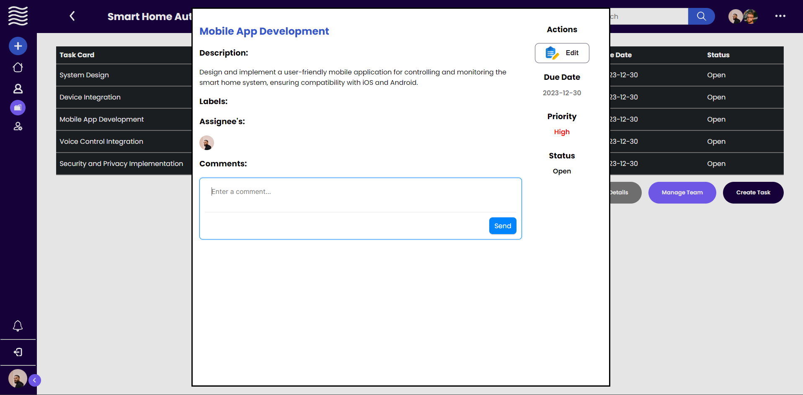

# PA: Product and Presentation

> Taskflow is the innovative online platform for task and project management, empowering users to efficiently lead their teams while gaining clear visibility into completed tasks and outstanding work.

## A9: Product

In a rapidly evolving project landscape, TaskFlow emerges as a transformative force for streamlined teamwork. It doesn't just extend capabilities; it enhances collaboration, ushering in a new era of efficient project management.

##### All-Purpose Tool for Every Team

TaskFlow is the go-to project management tool for a wide audience, catering to diverse needs. From individual contributors to project managers and team leaders, it provides a user-friendly interface for handling complex projects or daily tasks, fostering collaboration, and boosting productivity.

##### User-Focused Features

TaskFlow features a straightforward user role system, accommodating four distinct types of users. Unauthenticated users have limited access, primarily for registration, login, and password reset.

Members enjoy active participation within specific projects, fostering collaboration. Coordinators, with heightened access, oversee project management tools for effective coordination. Users can further tailor their experience by marking projects as favorites, prioritizing specific engagements.

##### Administrative Control and Enhanced Collaboration

Administrators, at the highest level, manage the overall website and user permissions, ensuring comprehensive control. Within projects, each task is equipped with a comments section, facilitating seamless communication and collaboration among team members. Users can also view the profiles of fellow members they collaborate with, enhancing transparency and connection.

This streamlined user hierarchy, combined with these additional features, ensures a customized and efficient experience for individuals at different stages of engagement with TaskFlow.

### 1\. Installation

First of all, to run this, you need to be connected to FEUP VPN and then execute the following commands:

```bash
composer install

docker login git.fe.up.pt:5050

./upload_image.sh

docker run -it -p 8000:80 --name=lbaw2323 -e DB_DATABASE="lbaw2323" -e DB_SCHEMA="lbaw2323" -e DB_USERNAME="lbaw2323" -e DB_PASSWORD="PASSWORD" git.fe.up.pt:5050/lbaw/lbaw2324/lbaw2323
```

[View Source Code](#)

### 2\. Usage

URL to the product: http://lbaw2323.lbaw.fe.up.pt

#### 2.1. Administration Credentials

First login in a admin user account and then enter the following [link](http://lbaw2323.lbaw.fe.up.pt/users)

| Email            | Password |
| ---------------- | -------- |
| john@example.com | pass     |

#### 2.2. User Credentials

| Type                    | Email             | Password |
| ----------------------- | ----------------- | -------- |
| Coordinator in projects | alice@example.com | pass     |
| Member in projects      | bob@example.com   | pass     |

### 3\. Application Help

### 4\. Input Validation

Input data undergoes thorough validation on both the client and server sides. For instance, when creating a task, the user must adhere to specific criteria, such as a task name not exceeding 255 characters. This validation is enforced by both the database and the backend, ensuring data integrity and a secure user experience.

### 5\. Check Accessibility and Usability

- [Accessibility](uploads/0309d15c81c17d1d9d649193063e6fc8/Checklist_de_Acessibilidade_-_SAPO_UX.pdf)
- [Usability](uploads/534ba82a5167ae95cea0d68bc1489a60/Checklist_de_Usabilidade_-_SAPO_UX.pdf)

### 6\. HTML & CSS Validation

- [HTML](uploads/0a22999d04b16979a2188da0809ad929/HTML.pdf)
- [CSS](uploads/963f9ac6179d4db176005566363ccca4/CSS.pdf)

### 7\. Revisions to the Project

A lot of thing were changed since the last submissions them being:

Incorporating several triggers, notably designed for notifications, has enhanced the functionality of our system. These triggers include: `decline_invite_trigger`, `accept_invite_trigger`, `invite_creation_trigger`, `project_member_promotion_trigger`, `notification_welcome_trigger`, `task_status_change`, `after_insert_project`, and `create_task_assignment_notification`.

Additionally, in the database, the introduction of the `task_team` table facilitates the assignment of multiple team members to a single task, optimizing collaborative efforts.

In regards to user stories we decided to change the priority of some of them:
- Changed priority of 'US25:Admin manage projects' to low.
- Changed priority of 'US24:Admin browse all projects' to low.
- Changed priority of 'US19:Admin account separation' to low.
- Remove of 'US6:Delete posts' because no longer made sense for our application.
- Remove of 'US4:Edit posts' because no longer made sense for our application.
- Remove of 'US16:Coordinator add user to task' because a coordinator already has that permission because the members also have.

### 9\. Implementation Details

#### 9.1. Libraries Used

Bootstrap and Laravel served as the main libraries in the project, handling front-end design and back-end development. Socialite facilitated seamless third-party authentication, enabling google login features. Additionally, Mailtrap allowed to forget password implementation. Together, these technologies contributed to a well-rounded and efficient web development process.

#### 9.2 User Stories

| US Identifier | Name                           | Module | Priority | Team Members                      | State |
| ------------- | ------------------------------ | ------ | -------- | --------------------------------- | ----- |
| US01          | Create a project               | M02    | High     | **Mario Branco**, Cristiano Rocha | 100%  |
| US02          | View my projects               | M02    | High     | **Mario Branco**, Cristiano Rocha | 100%  |
| US03          | Mark project as favorite       | M02    | High     | **Cristiano Rocha**, Mario Branco | 100%  |
| US05          | Create task                    | M03    | High     | **Cristiano Rocha**, Mario Branco | 100%  |
| US07          | Manage tasks                   | M03    | High     | **Cristiano Rocha**, Mario Branco | 100%  |
| US08          | Assign users to tasks          | M03    | High     | **Cristiano Rocha**, Mario Branco | 100%  |
| US09          | View task details              | M03    | High     | **Cristiano Rocha**, Mario Branco | 100%  |
| US10          | Add user to project            | M02    | High     | **Cristiano Rocha**, Mario Branco | 100%  |
| US11          | Assign new coordinator         | M02    | High     | **Cristiano Rocha**, Mario Branco | 100%  |
| US12          | Comment on task                | M03    | High     | **Cristiano Rocha**, Mario Branco | 100%  |
| US13          | Edit project details           | M02    | High     | **Cristiano Rocha**, Mario Branco | 100%  |
| US14          | Complete an assigned task      | M03    | High     | **Cristiano Rocha**, Mario Branco | 100%  |
| US15          | Leave project                  | M02    | High     | **Cristiano Rocha**, Mario Branco | 100%  |
| US17          | Remove project member          | M02    | High     | **Cristiano Rocha**, Mario Branco | 100%  |
| US18          | Archive project                | M02    | High     | **Cristiano Rocha**, Mario Branco | 100%  |
| US19          | Admin separated accounts       | M04    | low      | -                                 | 0%    |
| US20          | Receive notification           | M03    | High     | **Cristiano Rocha**, Mario Branco | 100%  |
| US21          | Assigned to task               | M03    | High     | **Cristiano Rocha**, Mario Branco | 100%  |
| US22          | Accepted invitation to Project | M02    | High     | **Cristiano Rocha**, Mario Branco | 100%  |
| US23          | Accepted invitation to Project | M02    | High     | **Cristiano Rocha**, Mario Branco | 100%  |
| US24          | Change in Project Coordinator  | M02    | High     | **Cristiano Rocha**, Mario Branco | 100%  |
| US25          | View project details           | M02    | low      | -                                 | 0%    |
| US26          | Profile page                   | M01    | High     | **Cristiano Rocha**, Mario Branco | 100%  |
| US27          | Modify profile                 | M01    | High     | **Cristiano Rocha**, Mario Branco | 100%  |
| US28          | Sign In                        | M01    | High     | **Cristiano Rocha**, Mario Branco | 100%  |
| US29          | Sign Up                        | M01    | High     | **Cristiano Rocha**, Mario Branco | 100%  |
| US30          | Logout                         | M01    | High     | **Cristiano Rocha**, Mario Branco | 100%  |
| US31          | Recover password               | M01    | High     | **Cristiano Rocha**, Mario Branco | 100%  |
| US32          | Manage authenticated users     | M04    | High     | **Cristiano Rocha**, Mario Branco | 100%  |

---

## A10: Presentation

### 1\. Product presentation

This project aims to establish a web-based system for efficient project management, catering to both personal and professional needs.
Users can create an account, enabling them to initiate new projects or accept invitations to existing ones. Within each project, users can generate tasks, comment on tasks, modify task status, and assign tasks to specific individuals. The system also features a side bar for quick access to navigation.

URL to the product: http://lbaw2323.lbaw.fe.up.pt

### 2\. Video presentation



[Video] https://youtu.be/gDbPiDzzqBQ

---

GROUP2323, 21/12/2023

- Cristiano Rocha, up202108813@fe.up.pt
- Mario Branco, up202008219@fe.up.pt
